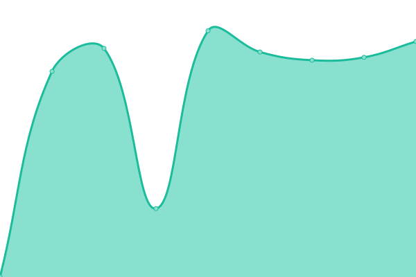
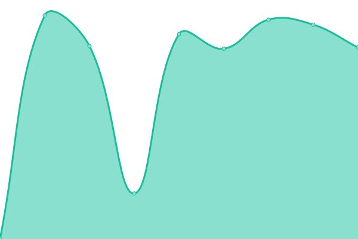
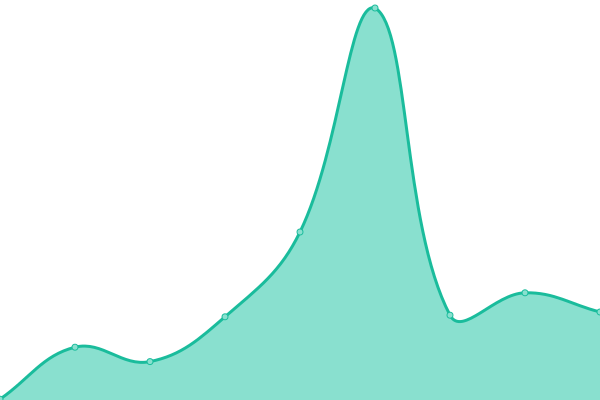
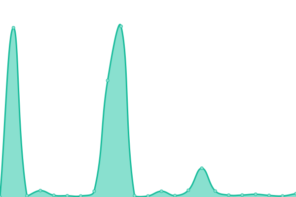
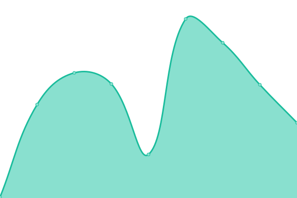

# [📈 Live Status](https://jeermuce.github.io/upptime): <!--live status--> **🟧 Partial outage**

This repository contains the open-source uptime monitor and status page for [jeermuce](https://jeermuce.github.io/upptime), powered by [Upptime](https://github.com/upptime/upptime).

With [Upptime](https://upptime.js.org), you can get your own unlimited and free uptime monitor and status page, powered entirely by a GitHub repository. We use [Issues](https://github.com/jeermuce/upptime/issues) as incident reports, [Actions](https://github.com/jeermuce/upptime/actions) as uptime monitors, and [Pages](https://jeermuce.github.io/upptime) for the status page.

<!--start: status pages-->
<!-- This summary is generated by Upptime (https://github.com/upptime/upptime) -->
<!-- Do not edit this manually, your changes will be overwritten -->
<!-- prettier-ignore -->
| URL | Status | History | Response Time | Uptime |
| --- | ------ | ------- | ------------- | ------ |
|  [raccoon 2  electric boogaloo](https://raccoon-2-electric-boogaloo.vercel.app/) | 🟩 Up | [raccoon-2-electric-boogaloo.yml](https://github.com/jeermuce/upptime/commits/HEAD/history/raccoon-2-electric-boogaloo.yml) | 

 2202ms
     
 | 

<a href="https://jeermuce.github.io/upptime/history/raccoon-2-electric-boogaloo">99.80%</a>
    

|  [csr-leptos](https://csr-leptos.vercel.app/) | 🟩 Up | [csr-leptos.yml](https://github.com/jeermuce/upptime/commits/HEAD/history/csr-leptos.yml) | 

 154ms
     
 | 

<a href="https://jeermuce.github.io/upptime/history/csr-leptos">99.81%</a>
    

|  [gallery](https://gallery-khaki-eight.vercel.app/) | 🟩 Up | [gallery.yml](https://github.com/jeermuce/upptime/commits/HEAD/history/gallery.yml) | 

 1406ms
     
 | 

<a href="https://jeermuce.github.io/upptime/history/gallery">99.81%</a>
    

|  [GET to csyc server](https://csyc.onrender.com/services?page=1&size=2) | 🟥 Down | [get-to-csyc-server.yml](https://github.com/jeermuce/upptime/commits/HEAD/history/get-to-csyc-server.yml) | 

 2080ms
     
 | 

<a href="https://jeermuce.github.io/upptime/history/get-to-csyc-server">51.28%</a>
    

|  [csyc client](https://front-end-18oj-6dwvt7mg2-csyc.vercel.app/) | 🟩 Up | [csyc-client.yml](https://github.com/jeermuce/upptime/commits/HEAD/history/csyc-client.yml) | 

 153ms
     
 | 

<a href="https://jeermuce.github.io/upptime/history/csyc-client">99.82%</a>
    

|  [GET to dogs server](https://pi-dogs-ocx3.onrender.com/dogs) | 🟥 Down | [get-to-dogs-server.yml](https://github.com/jeermuce/upptime/commits/HEAD/history/get-to-dogs-server.yml) | 

 2714ms
     
 | 

<a href="https://jeermuce.github.io/upptime/history/get-to-dogs-server">52.14%</a>
    

|  [dogs client](https://dogs-taupe-iota.vercel.app/) | 🟩 Up | [dogs-client.yml](https://github.com/jeermuce/upptime/commits/HEAD/history/dogs-client.yml) | 

 139ms
     
 | 

<a href="https://jeermuce.github.io/upptime/history/dogs-client">99.82%</a>
    

<!--end: status pages-->

[**Visit our status website →**](https://jeermuce.github.io/upptime)

## 📄 License

- Powered by: [Upptime](https://github.com/upptime/upptime)
- Code: [MIT](./LICENSE) © [Anand Chowdhary](https://anandchowdhary.com), supported by [Pabio](https://pabio.com)
- Data in the `./history` directory: [Open Database License](https://opendatacommons.org/licenses/odbl/1-0/)
